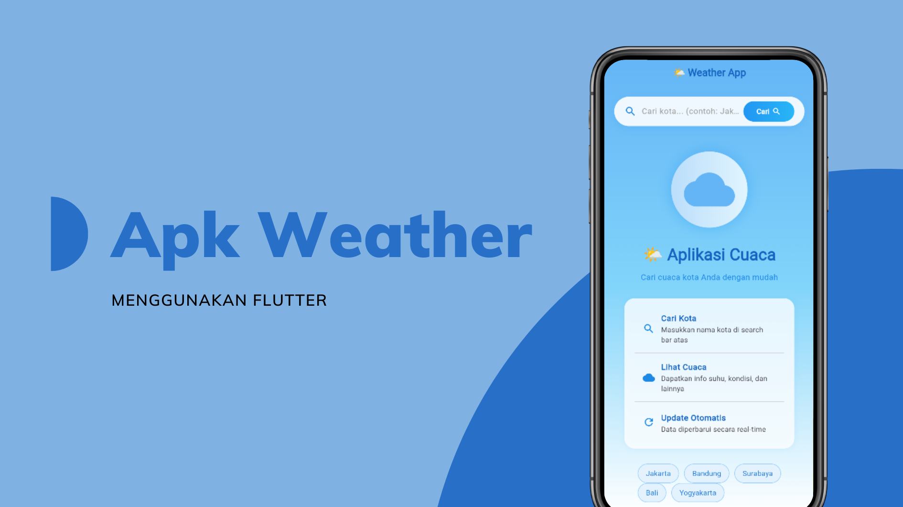

# 🌤️ Flutter Weather App

A beautiful and functional weather application built with Flutter. This project demonstrates modern Flutter development practices including API integration, state management, and responsive UI design.

## 📱 Screenshots

  

## ✨ Features

- 🔍 **Search Any City** - Get real-time weather data worldwide
- 🎨 **Dynamic UI** - Background changes based on weather conditions
- ⚡ **Fast & Responsive** - Smooth animations and transitions
- 📱 **Cross-Platform** - Works on Android, iOS, and Web
- 🛡️ **Error Handling** - User-friendly error messages and retry options
- 🌐 **Free API** - Uses Open-Meteo API (no API key required)

## 🏗️ Project Architecture
